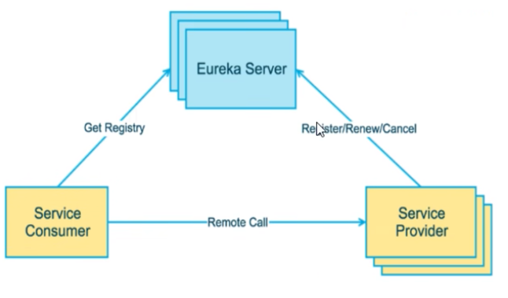
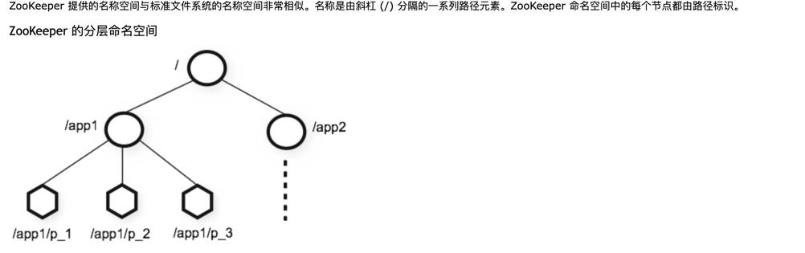

# 微服务 - Spring Cloud

### 微服务技术栈

### Eureka 服务管理
Eureka是Netflix开发的服务发现框架，本身是一个基于REST的服务，主要用于定位运行在AWS域中的中间层服务，以达到负载均衡和中间层服务故障转移的目的。

SpringCloud将它集成在其子项目spring-cloud-netflix中，以实现SpringCloud的服务发现功能

##### Eureka服务注册与发现
Eureka 采用了CS的设计架构，Eureka Server作为服务注册功能的服务器，它是服务注册的中心。而系统中的其他微服务，使用 Eureka 的客户端链接到
Eureka server并维持心跳连接。使开发人员可以通过Eureka serve来监控系统中各个微服务的运行状态.

在服务注册与发现中，有一个注册中心。当服务启动的时候，会把当前自己的服务器的信息，比如 服务地址、通讯地址等以别名方式注册到注册中心。另一方
（消费者｜服务提供者），以该别名的方式去注册中心上获取到实际的服务通讯地址，然后再实现本地RPC调用远程RPC。远程调用框架的核心设计思想：在于注册中心
，因为使用注册中心管理每个服务于服务之间的一个依赖关系（服务治理概念）。在任何RPC远程框架中，都会有一个注册中心（存放服务地址相关信息）

### Eureka 三种角色
* Eureka Server ：提供服务注册和发现等
* Service Provider：服务提供者：自身注册到Eureka Server，供消费端调用
* Service Consumer：服务消费方：从Eureka获取注册服务列表，从而能够消费服务

## zookeeper
ZooKeeper是一个集中式服务，用于维护配置信息、命名、提供分布式同步、提供组服务. 支持高度可靠的分布式协调.

### zookeeper 数据模型和分层命名空间
zookeeper 数据模型: 其实就是用来存储和处理数据的。类似于数据库系统。不过 zookeeper 的数据模型更像电脑中的文件系统，有一个根文件夹
（固定的根节点 / ），下面有很多字文件夹（可以在根节点创建多个子节点，支持逐级创建）

## consul
#### what is consul?
HashiCorp Consul is a service networking solution that enables teams to manage secure network connectivity between services and across on-prem and multi-cloud environments and runtimes. Consul offers service discovery, service mesh, traffic management, and automated updates to network infrastructure device. You can use these features individually or together in a single Consul deployment.

Consul 是一套开源的分布式服务发现和配置管理系统。由 HashiCorp 公司使用Go语言开发。

提供了微服务系统中的服务治理、配置中心、控制总线等。这些功能即可以单独使用，也可以一起使用构建全方位的服务网格。

#### 功能
服务发现 提供http 和 dns 两种发现方式
监控检测 支持多方式， http、tcp、docker、shell脚本定制化
KV存储 key、value 的存储方式
多数据中心 consul支持多数据中心
可视化web界面

## OpenFeign
### 简介

OpenFeign 提供了一种**声明式的远程调用接口**。

###  OpenFeign 能做什么

目的是为了简易HTTP客户端的编写。

之前在 笔记中介绍了 Ribbon + RestTemplate 的使用。Ribbon + RestTemplate 是多http请求做了封装处理，形成了模版化的调用。但是在实际的开发中，由于对服务依赖的调用可能不止一处，往往一个接口被多处调用，所以需要对每个微服务进行封装。鉴于此 Feign 在此基础上为我们提供了封装操作，由Feign 帮我门定义和实现依赖服务接口的定义。因此简化了我们的操作，只需要创建一个接口并使用注解的形式来配置它（比如Mapper接口上标注@Mapper注解，现在是在一个微服务接口上标注一个@FeignClient注解），就可以完成对服务接口的绑定，简化了Spring cloud Ribbon使用时候封装客户端的开发量

### 如何使用

Declarative REST Client: Feign creates a dynamic implementation of an interface decorated with JAX-RS or Spring MVC annotations

在主启动类上通过注解 @EnableFeignClients、 接口上通过注解 @FeignClient 实现