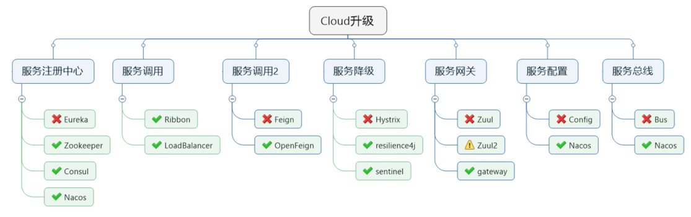

# 微服务 - Spring Cloud

### 微服务技术栈

### Eureka 服务管理
Eureka是Netflix开发的服务发现框架，本身是一个基于REST的服务，主要用于定位运行在AWS域中的中间层服务，以达到负载均衡和中间层服务故障转移的目的。

SpringCloud将它集成在其子项目spring-cloud-netflix中，以实现SpringCloud的服务发现功能

##### Eureka服务注册与发现
Eureka 采用了CS的设计架构，Eureka Server作为服务注册功能的服务器，它是服务注册的中心。而系统中的其他微服务，使用 Eureka 的客户端链接到
Eureka server并维持心跳连接。使开发人员可以通过Eureka serve来监控系统中各个微服务的运行状态.

在服务注册与发现中，有一个注册中心。当服务启动的时候，会把当前自己的服务器的信息，比如 服务地址、通讯地址等以别名方式注册到注册中心。另一方
（消费者｜服务提供者），以该别名的方式去注册中心上获取到实际的服务通讯地址，然后再实现本地RPC调用远程RPC。远程调用框架的核心设计思想：在于注册中心
，因为使用注册中心管理每个服务于服务之间的一个依赖关系（服务治理概念）。在任何RPC远程框架中，都会有一个注册中心（存放服务地址相关信息）

### Eureka 三种角色
* Eureka Server ：提供服务注册和发现等
* Service Provider：服务提供者：自身注册到Eureka Server，供消费端调用
* Service Consumer：服务消费方：从Eureka获取注册服务列表，从而能够消费服务

